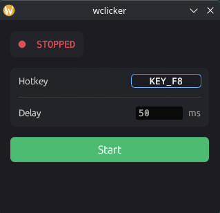

# wclicker

A simple, lightweight autoclicker for Linux (X11/Wayland) built with Rust and egui.



## Features

- Global hotkey toggle (default: F8, rebindable)
- Configurable click delay
- Settings persist across sessions (`~/.config/wclicker/config.toml`)
- Works on both X11 and Wayland via evdev/uinput
- Minimal resource usage

## Requirements

Your user must have access to:

- **`/dev/input/event*`** (read) — typically the `input` group
- **`/dev/uinput`** (write) — via the `uinput` group or a udev rule

```sh
# Common fix (log out and back in after running):
sudo usermod -aG input $USER

# For uinput, either add the group:
sudo groupadd -f uinput
sudo usermod -aG uinput $USER

# Or create a udev rule:
echo 'KERNEL=="uinput", MODE="0660", GROUP="input"' | sudo tee /etc/udev/rules.d/99-uinput.rules
sudo udevadm control --reload-rules && sudo udevadm trigger
```

## Install

### From releases

Download the latest binary from [Releases](../../releases).

### From source

```sh
cargo install --path .
```

Or build manually:

```sh
cargo build --release
# Binary at target/release/wclicker
```

## Usage

```sh
wclicker
```

- Press **F8** (or your configured hotkey) to toggle clicking
- Click the hotkey button in the UI to rebind
- Adjust the delay in milliseconds

## License

See [LICENSE](LICENSE).
